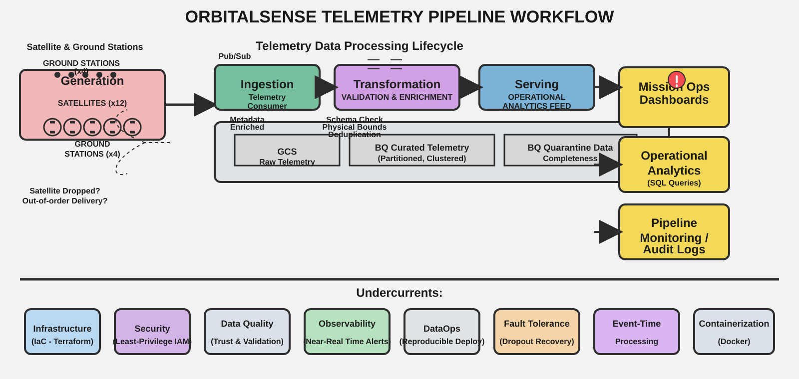
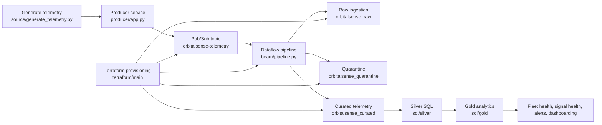

# OrbitalSense

OrbitalSense is a Google Cloud data engineering project that simulates a satellite telemetry platform. It models a fleet of 12 satellites emitting telemetry through 4 ground stations, with intentionally noisy and incomplete records so the pipeline can demonstrate real-world ingestion, validation, deduplication, storage, and operational analytics.

The project is designed to show how a production-grade telemetry flow behaves under imperfect inputs:

- raw telemetry is generated and published to Pub/Sub
- an Apache Beam pipeline validates and filters bad data
- duplicate events are removed using semantic deduplication
- valid records are stored in curated BigQuery datasets
- SQL models summarize fleet health, communication quality, and mission operations
- Terraform provisions the cloud resources needed to run the platform

## Project goal

This repository demonstrates a realistic end-to-end data engineering lifecycle for satellite operations:

- collect telemetry from multiple spacecraft sources
- ingest millions of records through a streaming platform
- quarantine malformed data without losing raw provenance
- preserve event-time semantics and deduplicate duplicate messages
- build an analytics layer for operational monitoring and reporting

## Workflow overview



The project is structured around the following flow:



## What the project simulates

This is a synthetic but operationally realistic dataset. It deliberately includes:

- 12 satellites across 4 ground stations
- 4 telemetry domains: POWER, THERMAL, COMMS, ORBITAL
- duplicate messages that mimic at-least-once delivery
- malformed rows with impossible values, missing fields, and invalid timestamps
- a simulated ground contact dropout for SAT-07
- weak or degraded communications on SAT-11

The data generator also produces supporting dataset artifacts:

- source/orbitalsense_telemetry_raw.csv
- source/orbitalsense_dataset_summary.json
- source/orbitalsense_data_dictionary.md

## Repository structure

```text
.
├── README.md
├── requirements.txt
├── orbitalsense_workflow.svg
├── beam/
│   ├── Dockerfile
│   ├── pipeline.py
│   └── requirements.txt
├── producer/
│   ├── app.py
│   ├── Dockerfile
│   └── requirements.txt
├── source/
│   ├── generate_telemetry.py
│   ├── orbitalsense_data_dictionary.md
│   ├── orbitalsense_dataset_summary.json
│   └── orbitalsense_telemetry_raw.csv
├── sql/
│   ├── 00_create_datasets.sql
│   ├── silver/
│   │   ├── silver_comms.sql
│   │   ├── silver_orbital.sql
│   │   ├── silver_power.sql
│   │   ├── silver_telemetry.sql
│   │   └── silver_thermal.sql
│   └── gold/
│       ├── dim_ground_station.sql
│       ├── dim_satellite.sql
│       ├── fact_telemetry.sql
│       ├── gold_communication_health.sql
│       ├── gold_contact_gaps.sql
│       ├── gold_data_completeness.sql
│       ├── gold_data_quality.sql
│       ├── gold_pipeline_quality.sql
│       ├── gold_satellite_health.sql
│       ├── mission_operations_dasboard.sql
│       └── weakest_communication_satellite.sql
├── terraform/
│   ├── views.tf
│   ├── bootstrap/
│   └── main/
│       ├── apis.tf
│       ├── artifact_registry.tf
│       ├── bigquery.tf
│       ├── cloud_run.tf
│       ├── dataflows.tf
│       ├── iam.tf
│       ├── main.tf
│       ├── outputs.tf
│       ├── provider.tf
│       ├── pubsub.tf
│       ├── storage.tf
│       ├── terraform.tfvars
│       └── variables.tf
├── tests/
│   ├── test_dedup.py
│   └── test_validation.py
└── requirements.txt
```

## Data generation layer

The raw telemetry is created in source/generate_telemetry.py.

This script generates a 14-day telemetry history for all satellites using 5-minute intervals, with each satellite emitting one reading per subsystem at each tick. It includes:

- time-varying orbital position and system behavior
- one simulated downtime window for SAT-07
- degraded communications on SAT-11
- malformed records and deliberate duplicates
- shuffled arrival order to simulate asynchronous relay timing

The generated CSV and summary JSON are specifically designed to test the quality controls implemented in the Beam pipeline.

## Producer layer

The producer service in producer/app.py publishes telemetry into a Google Pub/Sub topic.

Key responsibilities:

- create a Flask-based app
- read configuration from environment variables
- publish JSON payloads to Pub/Sub
- simulate operational anomalies such as transient communication loss
- maintain realistic mission telemetry patterns for the stream

This layer is the front door of the streaming data platform.

## Ingestion and validation layer

The Beam pipeline in beam/pipeline.py is the core processing engine.

It performs the following stages:

1. reads messages from a Pub/Sub subscription
2. stores raw payloads in BigQuery
3. validates all required fields and data types
4. rejects malformed elements using reason codes and details
5. computes a semantic deduplication key from the actual telemetry data
6. applies event-time windows and handles lateness
7. filters duplicates to keep the canonical event
8. writes curated records into the trusted telemetry table

### Validation rules in the pipeline

The pipeline enforces checks for:

- required fields are present and non-empty
- valid satellite and ground-station identifiers
- supported subsystem names
- parseable timestamps in ISO-8601 format
- future timestamps not allowed
- received timestamps must not be earlier than event timestamps
- numeric sensor values must stay within realistic operational ranges
- COMMS status must align with signal strength and error profile

## Storage and data architecture

Terraform provisions the core infrastructure under terraform/main.

The infrastructure includes:

- Pub/Sub topic and subscription resources
- BigQuery datasets for raw, curated, quarantine, and gold tables
- Cloud Run deployment for the producer app
- Dataflow-related resources and storage configuration
- IAM bindings for publisher and subscriber access

The BigQuery datasets defined by the Terraform code are:

- orbitalsense_raw
- orbitalsense_curated
- orbitalsense_quarantine
- orbitalsense_gold

## Data layer model

### Raw layer

The raw dataset stores every inbound payload before validation. It keeps the original message and ingestion metadata so the data team can trace and audit all source events.

### Quarantine layer

Malformed or invalid data is separated into the quarantine dataset for inspection rather than silently discarded. This preserves operational traceability and helps identify upstream data-quality issues.

### Curated / silver layer

Validated and deduplicated telemetry becomes the trusted operational dataset. This layer includes normalized data types, consistent timestamps, and a deduplication key used to collapse near-identical duplicates.

### Gold layer

The gold layer builds analytical features and operational summaries. It powers fleet-level reporting, signal-quality analysis, contact-gap analysis, and mission health dashboards.

## SQL layer

The SQL project is divided into two main layers.

### Silver SQL

Files in sql/silver prepare normalized, warehouse-ready telemetry tables by subsystem:

- silver_telemetry.sql
- silver_power.sql
- silver_thermal.sql
- silver_comms.sql
- silver_orbital.sql

These tables are partitioned and clustered for operational queries and downstream analysis.

### Gold SQL

Files in sql/gold produce metrics and mission-ready views:

- dim_satellite.sql — satellite dimension
- dim_ground_station.sql — ground-station dimension
- fact_telemetry.sql — fact table for telemetry observations
- gold_satellite_health.sql — health and fleet-status summaries
- gold_communication_health.sql — signal and communication quality metrics
- gold_contact_gaps.sql — blackout and contact-loss detection
- gold_data_completeness.sql — completeness by subsystem and time
- gold_data_quality.sql — invalid-data and quality summary metrics
- gold_pipeline_quality.sql — telemetry pipeline performance and data-loss checks
- mission_operations_dasboard.sql — aggregated mission dashboard output
- weakest_communication_satellite.sql — operational risk ranking

## Data engineering use cases

This project is built to answer operational questions such as:

- Which satellites are healthy or trending toward unhealthy states?
- Where are communication quality and signal strength degrading?
- Which satellites experienced contact gaps or blackout periods?
- How much data is malformed or duplicated before cleanup?
- What is the quality of the ingestion and transformation pipeline over time?
- Which telemetry domains are missing the most data?

## Local setup

### 1. Install project dependencies

```bash
pip install -r requirements.txt
```

For the local producer and Beam components, install service-specific requirements as needed:

```bash
pip install -r producer/requirements.txt
pip install -r beam/requirements.txt
```

### 2. Generate synthetic telemetry

```bash
python source/generate_telemetry.py
```

This produces the raw CSV dataset and summary metadata under source/.

### 3. Provision Google Cloud infrastructure

The Terraform templates under terraform/main define the cloud platform footprint. Update the variable files and run Terraform in the target project:

```bash
cd terraform/main
terraform init
terraform plan
terraform apply
```

### 4. Run the producer

Use the configured Cloud Run or local Flask service to emit telemetry into Pub/Sub.

### 5. Run the Dataflow pipeline

Deploy or execute the Beam pipeline in beam/pipeline.py to process the Pub/Sub stream into BigQuery.

### 6. Load the SQL layer

Apply the dataset creation script and then the silver/gold SQL files in BigQuery.

```sql
-- example
bq query --use_legacy_sql=false < sql/00_create_datasets.sql
```

## Testing

The project includes validation-oriented tests under tests/.

These are intended to check:

- duplicate detection logic
- validation behavior for malformed telemetry records

The current test files are placeholders for stronger pipeline validation coverage and can be extended as the project evolves.

## Why this project matters

OrbitalSense is a compact but realistic reference implementation of a modern cloud-native telemetry platform. It combines synthetic data generation, streaming analytics, quality gates, and operational modeling into one repository, making it useful for:

- data engineering demos
- ETL and streaming architecture practice
- telemetry quality analysis
- event-time processing examples
- Google Cloud BigQuery and Dataflow experimentation

## Related artifacts

- Data dictionary: source/orbitalsense_data_dictionary.md
- Dataset summary: source/orbitalsense_dataset_summary.json
- Workflow image: orbitalsense_workflow.svg
- Terraform configuration: terraform/main
- Analytics SQL: sql/

```bash
pip install -r requirements.txt
```

### 2. Provision Google Cloud resources

Use the Terraform templates under terraform/bootstrap and terraform/main to provision the project infrastructure.

### 3. Create BigQuery datasets

Apply the dataset creation SQL in sql/00_create_datasets.sql.

### 4. Start the telemetry producer

The producer reads environment variables such as PROJECT_ID and PUBSUB_TOPIC, then publishes telemetry into the Pub/Sub topic.

### 5. Run the Dataflow pipeline

Run beam/pipeline.py with the Pub/Sub subscription and the raw, curated, and quarantine BigQuery tables configured as pipeline arguments.

### 6. Execute the SQL models

Run the silver and gold SQL scripts in BigQuery to materialize the analytics tables used for operations dashboards and investigative queries.

## Data quality expectations

The generated dataset is intentionally designed to help evaluate a telemetry pipeline. Typical metrics from the synthetic dataset are:

- malformed records: about 2%
- duplicate records: about 3%
- one known communication dropout window within the 14-day dataset
- one degraded communications satellite (SAT-11)

These patterns are meant to be found by the pipeline and visible in the analytics output.

## Notes

- The project uses event-time windows rather than ingestion-order semantics.
- Deduplication is semantic, not transport-based, so duplicate payloads collapse even when message IDs differ.
- Raw payloads are preserved even when a message is invalid or quarantined.
- The synthetic generator is reproducible because it uses a fixed seed.

## Summary

This repository demonstrates a complete telemetry data platform pattern in a compact, cloud-native format:

- source data generation
- streaming ingestion
- validation and quarantine
- event-time processing
- semantic deduplication
- BigQuery analytics
- operational health reporting

It is well suited for learning streaming data engineering, data quality handling, and cloud-native analytics workflows.
